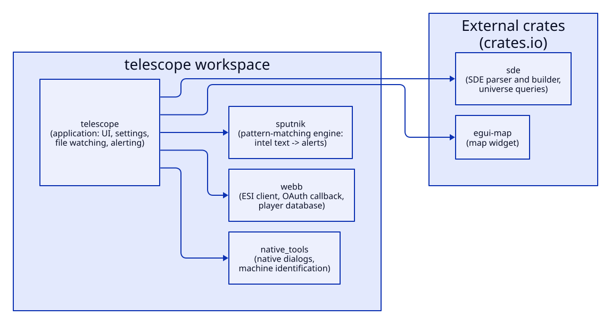
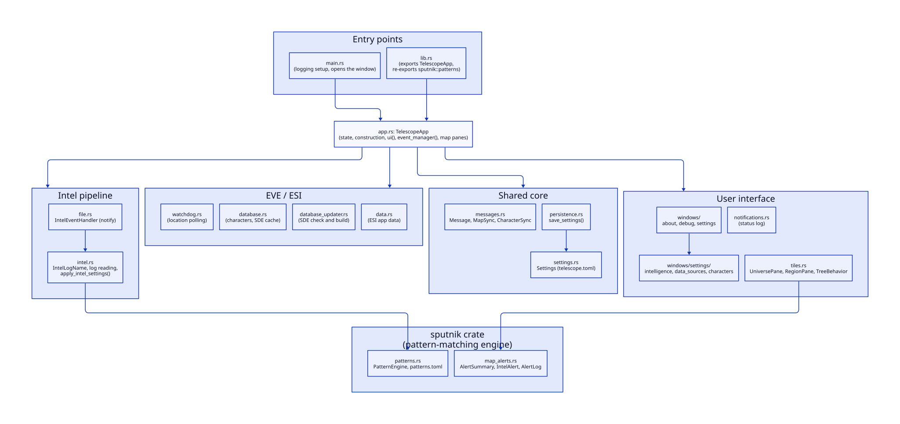
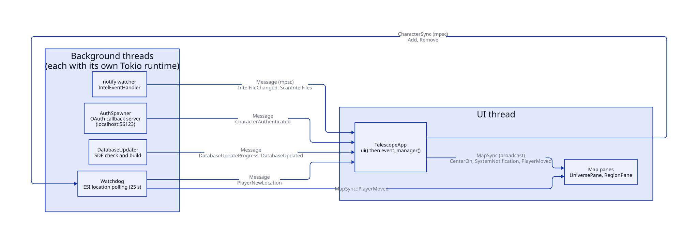
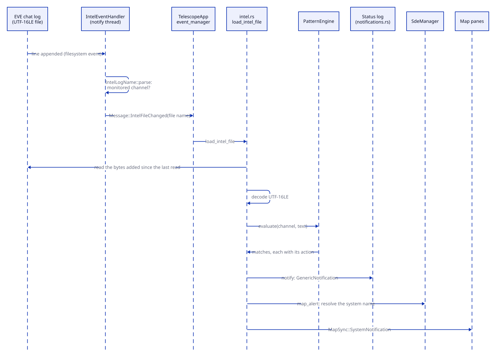
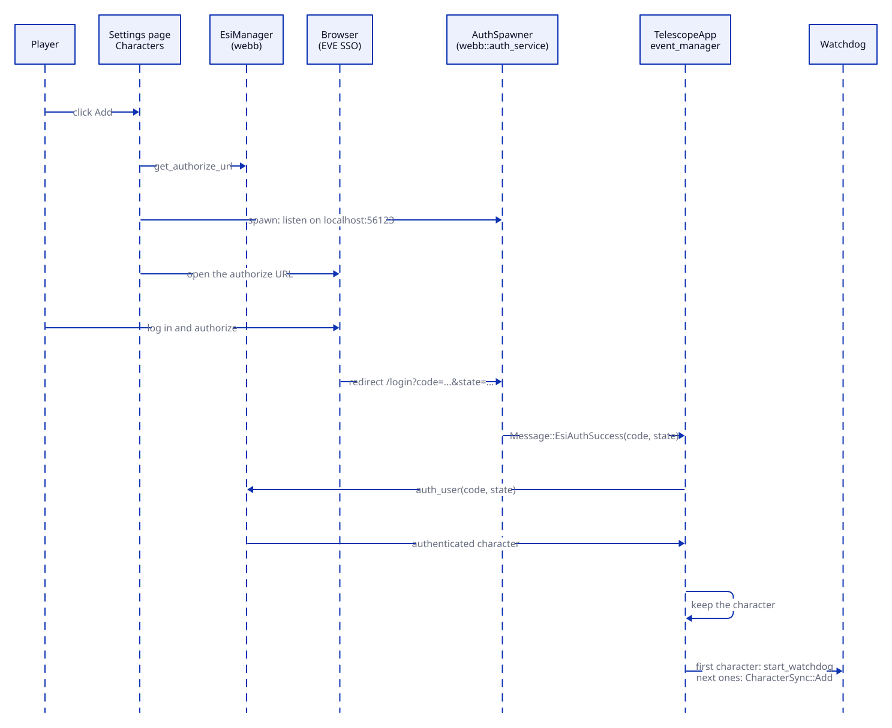
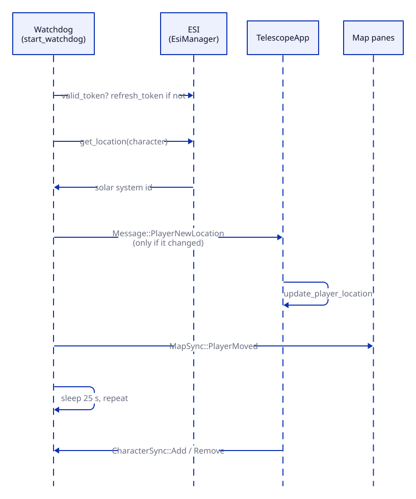

# Architecture

Telescope is a desktop application (egui/eframe with the wgpu renderer) that
watches the chat logs of EVE Online, evaluates their text against configurable
pattern rules and shows the resulting alerts on interactive maps of New Eden.
Characters linked through EVE SSO are followed through ESI so the maps can show
where they are and warn about nearby threats.

This document is a map of the code: where things live and how they talk to
each other. For how to build and run it see [BUILD.md](BUILD.md).

## Workspace

| Crate | Path | Role |
|-------|------|------|
| `telescope` | `crates/telescope` | The application: a binary plus a small library (`TelescopeApp` and `patterns`). UI, settings, file watching and alerting. |
| `webb` | `crates/webb` | EVE back end with no UI: the local OAuth callback server, the ESI client and the local player database. |
| `native_tools` | `crates/native_tools` | OS-specific code: native file / folder dialogs and per-machine identification. |



All the diagrams in this document are generated with [D2](https://d2lang.com/)
from the `.d2` files in [`docs/architecture`](docs/architecture). Edit the
source and regenerate the SVGs (the sequence diagrams ignore the layout
option):

```sh
for f in docs/architecture/*.d2; do d2 --pad 24 --layout=elk "$f" "${f%.d2}.svg"; done
```

Two more crates by the same author, published on crates.io, are used from outside this workspace:

* `sde`: parses CCP's Static Data Export, builds the SDE database and answers
  universe queries (`SdeManager`, `Universe`).
* `egui-map`: the egui widget that draws the maps.

Both are resolved from crates.io. The workspace `Cargo.toml` keeps
commented-out `[patch.crates-io]` entries that point at sibling checkouts
(`../sde` and `../egui-map`): uncomment them to develop those crates together
with Telescope.

### `crates/webb`

| Module | Purpose |
|--------|---------|
| `auth_service` | Tiny `hyper` server that receives the SSO redirect (`/login?code=...&state=...`) and hands both values to the application. |
| `esi` | `EsiManagerCore`: authorization, token refresh, location and portrait queries, and reading / writing characters, corporations and alliances. |
| `esi/player_database` | SQLite schema and queries of the player database (encrypted with SQLCipher under the default `crypted-db` feature). |
| `esi/data` | ESI client configuration. |
| `objects` | Domain types: tokens and the `Character`, `Corporation` and `Alliance` entities. |

### `crates/native_tools`

| Module | Purpose |
|--------|---------|
| `dialog` | Open file / folder dialogs: `IFileOpenDialog` on Windows, `NSOpenPanel` on macOS, the XDG desktop portal on Linux. |
| `zbus` (Linux only) | Machine identification through DMI, D-Bus and machine-id fallbacks. |
| `lib.rs` | Per-OS `get_*_unique_id` functions. |

## The `telescope` crate

```text
crates/telescope/src
├── main.rs                  entry point: logging / tracing setup, opens the window
├── lib.rs                   exports TelescopeApp and patterns; loads the translations
├── i18n.rs                  interface language: available languages, "auto", switching
├── app.rs                   TelescopeApp: state, construction, per-frame ui(),
│                            event_manager() and map pane management
└── app/
    ├── data.rs              static ESI application data (scopes, callback URL, keys)
    ├── database.rs          storing linked characters, SDE build cache, reload after an SDE update
    ├── database_updater.rs  progress window + background SDE check / build
    ├── file.rs              notify event handler for the chat log directory
    ├── intel.rs             chat log name parsing (IntelLogName), reading and decoding
    │                        logs, running the patterns, apply_intel_settings()
    ├── messages.rs          Message, MapSync, CharacterSync, spawners and send helpers
    ├── notifications.rs     the on-screen status log
    ├── patterns.rs          pattern engine and the patterns.toml format (has its own docs)
    ├── persistence.rs       save_settings()
    ├── settings.rs          Settings: paths, map options, channels; persisted to a TOML file
    ├── tiles.rs             egui_tiles panes: UniversePane, RegionPane, TreeBehavior
    ├── watchdog.rs          background location polling of the linked characters
    ├── windows.rs
    └── windows/
        ├── about.rs         About window
        ├── debug.rs         debug window
        ├── settings.rs      Settings window frame (menu, page match, Save button)
        └── settings/
            ├── general.rs        interface language
            ├── intelligence.rs   alerts, monitored channels, start-up maps
            ├── data_sources.rs   database paths, SDE update button
            └── characters.rs     linked characters
```

The interface texts live in `crates/telescope/locales/<code>.toml` (see
[Languages](#languages)).



`TelescopeApp` is one struct; the modules above only add `impl TelescopeApp`
blocks (or free helpers), so the state stays in a single place and every
submodule can reach it.

## Runtime files

Telescope reads and writes these in the directory it runs from:

| File | Content |
|------|---------|
| `telescope.toml` | User settings (`Settings`). |
| `patterns.toml` | Alert rules. Created from a built-in template when missing, and regenerated (keeping a backup) when corrupt. |
| `sde.db` | The SDE database. Built automatically when it does not exist. |
| player database | Linked characters and one OAuth token set per character (`telescope.db` by default; the path is set in *Settings -> Data Sources*). Its schema version is stored in `metadata`: on startup a database from an older version only gets the pending migration scripts (`MIGRATIONS` in `player_database.rs`), keeping its data, and the user is notified. A new database is created with the base schema (version 0) followed by every migration, so both paths end in the same schema. |

## Languages

Every text the user reads comes from `t!("section.key")` (`rust-i18n`), looked
up in `crates/telescope/locales/<code>.toml`: one file per language, all with
the same keys, embedded in the binary at compile time. A key missing from a
language falls back to English, but an empty value is shown blank. The `i18n`
tests check that every file has exactly the keys of `en.toml`, and the same
`%{placeholders}` in every value that isn't empty.

- **Adding a language** is adding its file (copy `en.toml`, translate the
  values, including `language.name`). *Settings -> General* lists it on its own
  once `language.name` has a value. `es.toml` is such a template today: every
  key, empty values, not offered yet.
- **The chosen language** is `language` in `telescope.toml`'s `[ui]` table:
  `"auto"` (the operating system's language, English when there is no file for
  it) or a file name such as `"es"`. It is applied at start-up and as soon as
  it changes in *Settings -> General*, and saved right away like the rest of
  `[ui]`.
- **Not translated:** `tracing` output, the log panel messages and the Debug
  window, so bug reports read the same in every language.
- **Fonts:** Noto Sans CJK (`assets/NotoSansCJK-Medium.ttc`, Simplified
  Chinese face) is always the fallback after egui's own fonts, whatever the
  interface language: intel channels carry Chinese, Japanese, Korean and
  Russian lines. `TelescopeApp::font_definitions` sets it up and a test checks
  those scripts are drawn.

## Threads and messages

The UI runs on the main thread: every frame `TelescopeApp::ui` first drains
`event_manager()` and then draws. Anything slow or blocking runs elsewhere, on
its own thread with a small Tokio runtime, and reports back with messages:



| Channel | Type | Direction |
|---------|------|-----------|
| `Message` | `mpsc` | anything -> the app (`event_manager` dispatches it) |
| `MapSync` | `broadcast` | the app -> every map pane (center on, system alert, player moved) |
| `CharacterSync` | `mpsc` | the app -> the watchdog (add / remove a linked character) |

From the UI thread use `MessageSpawner::spawn`; from async code use
`send_app_message`. `Message::kind()` gives a short name for tracing without
logging the payload.

Background threads: the `notify` watcher callbacks (`file.rs`), the OAuth
callback server (`AuthSpawner`), the watchdog and the `DatabaseUpdater`.

## Main flows

### Chat log -> alert



1. `IntelEventHandler` (`file.rs`) receives filesystem events for the intel
   directory. Writes to the log of a monitored channel become
   `Message::IntelFileChanged`; files appearing or disappearing become
   `Message::ScanIntelFiles`. Channels are recognised with
   `IntelLogName::parse`, the only place that knows the log file name format.
2. `event_manager` calls `load_intel_file`, which reads only the bytes added
   since the last read and decodes them from UTF-16LE.
3. `parse_intel_data` runs `PatternEngine::evaluate` on the text. Each match
   carries an action:
   * `notify` sends a `GenericNotification`, shown in the status log
     (`notifications.rs`).
   * `map_alert` resolves the captured solar system through the SDE and sends
     `MapSync::SystemNotification`, which the map panes highlight.

### Linking a character



1. *Settings -> Characters -> Add* asks `EsiManager` for the authorize URL,
   hands `AuthSpawner` an `AuthRequest` (a clone of the `EsiManager` plus that
   authorize info) and opens the URL in the browser.
2. The `AuthSpawner` thread runs `webb::auth_service` on
   `http://localhost:56123/login`. When the redirect's `code` and `state`
   arrive, that same background thread completes the authorization with its
   `EsiManager` clone (`EsiManager::auth_user`: token exchange, character,
   corporation and alliance lookups, and storing the character), so the UI
   thread never waits on the network.
3. The result comes back as `Message::CharacterAuthenticated`.
   `handle_character_authenticated` (`character_link.rs`) takes that
   character's tokens from the clone (`EsiManager::adopt_session`), keeps the
   character (a re-linked character replaces its old entry), and starts the
   watchdog if it is the first one; otherwise it sends `CharacterSync::Add`
   (the watchdog then reloads the stored tokens).

### Location tracking



`start_watchdog` polls ESI every 25 seconds. Each character is asked for its
location with its own token (an EVE SSO token only works for the character
that logged in), refreshed when needed. A change produces
`Message::PlayerNewLocation` (the app stores the new location) and
`MapSync::PlayerMoved` (the map panes move the marker). If a character's token
is rejected (401/403) or can't be renewed, only that character stops being
followed, with a notification to link it again; linking it again resumes it.
The task ends when no characters are left.

### SDE database

`DatabaseUpdater` runs on its own thread: it checks CCP's SDE index, downloads
and extracts it when needed, creates the schema and builds the database,
reporting through `Message::DatabaseUpdateProgress` and
`Message::DatabaseUpdated`. It starts automatically when the database does not
exist and on demand from *Settings -> Data Sources*.

### Saving settings

The Save button calls `save_settings` (`persistence.rs`): it records the
start-up regions, calls `apply_intel_settings` (updates the channel list the
watcher reads and re-registers the directory watch) and writes the settings
file.

## Extending Telescope

* **A settings page:** add a variant to `SettingsPage` and to `SettingsPage::ALL`
  and `title()` (`messages.rs`), write `show_<name>_page` in a new file under
  `windows/settings/`, and add its arm to the `match` in `windows/settings.rs`.
* **A pattern action:** add a variant to `ActionConfig` (`patterns.rs`) and
  handle it in `parse_intel_data` (`intel.rs`).
* **A message:** add a variant to `Message` and to `Message::kind()`
  (`messages.rs`), and handle it in `event_manager` (`app.rs`).
