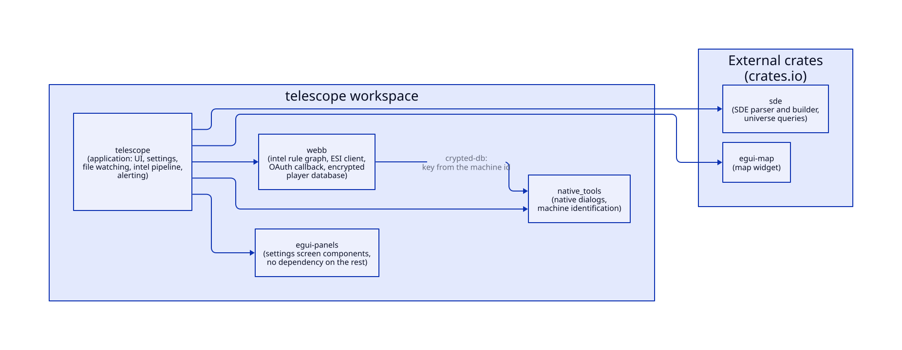
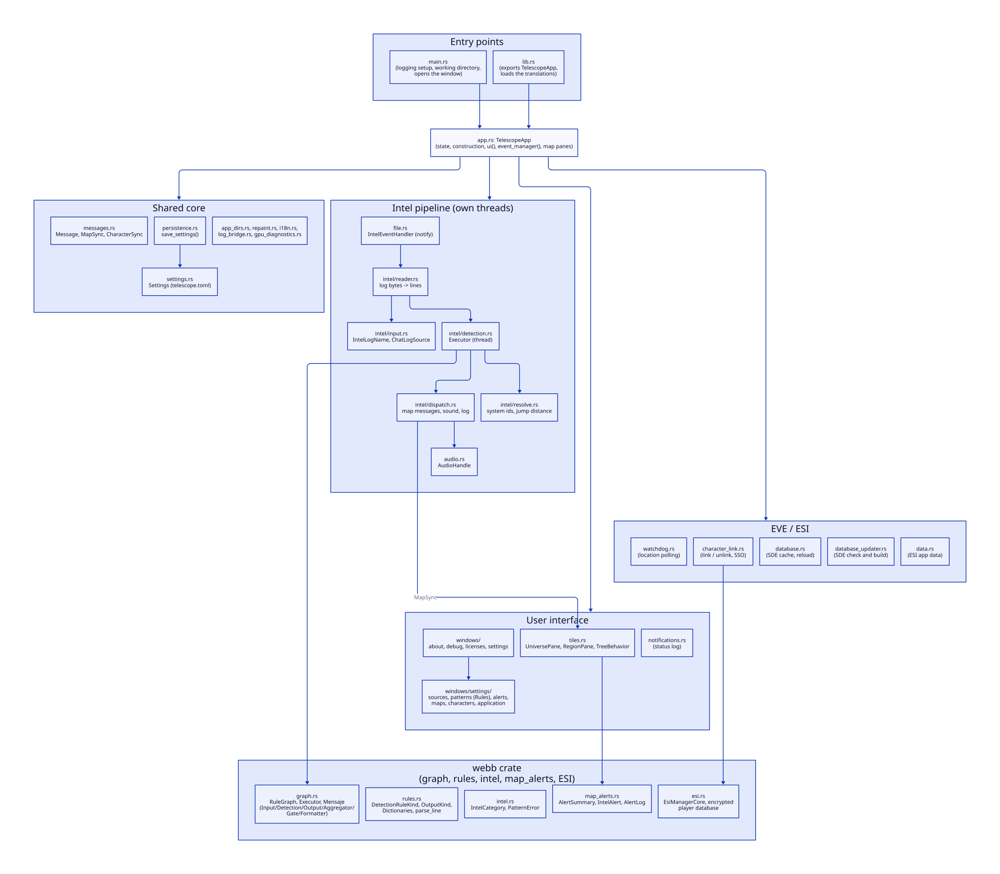
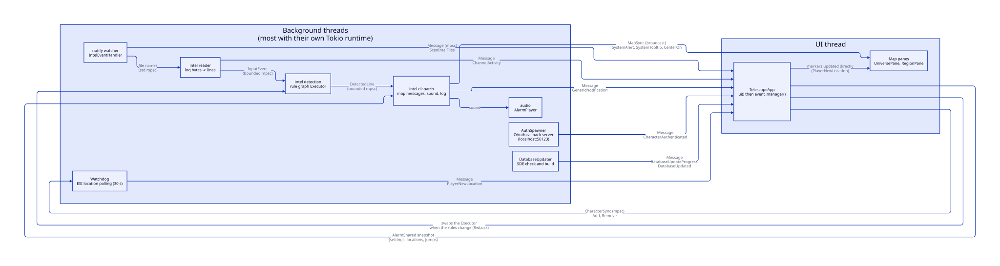
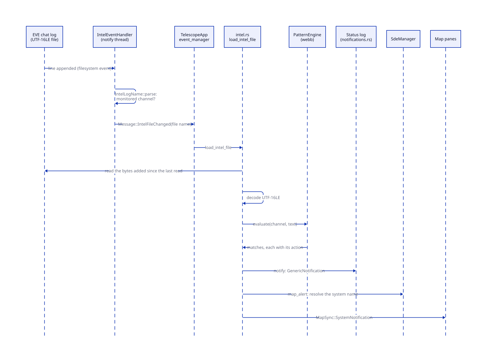
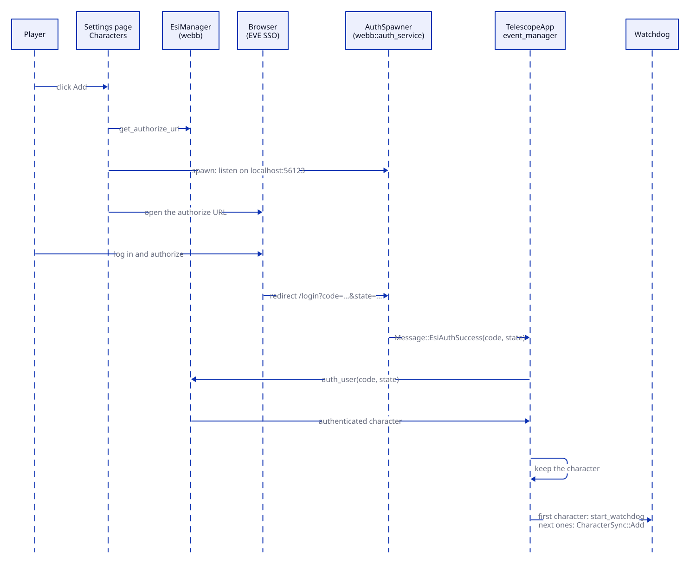
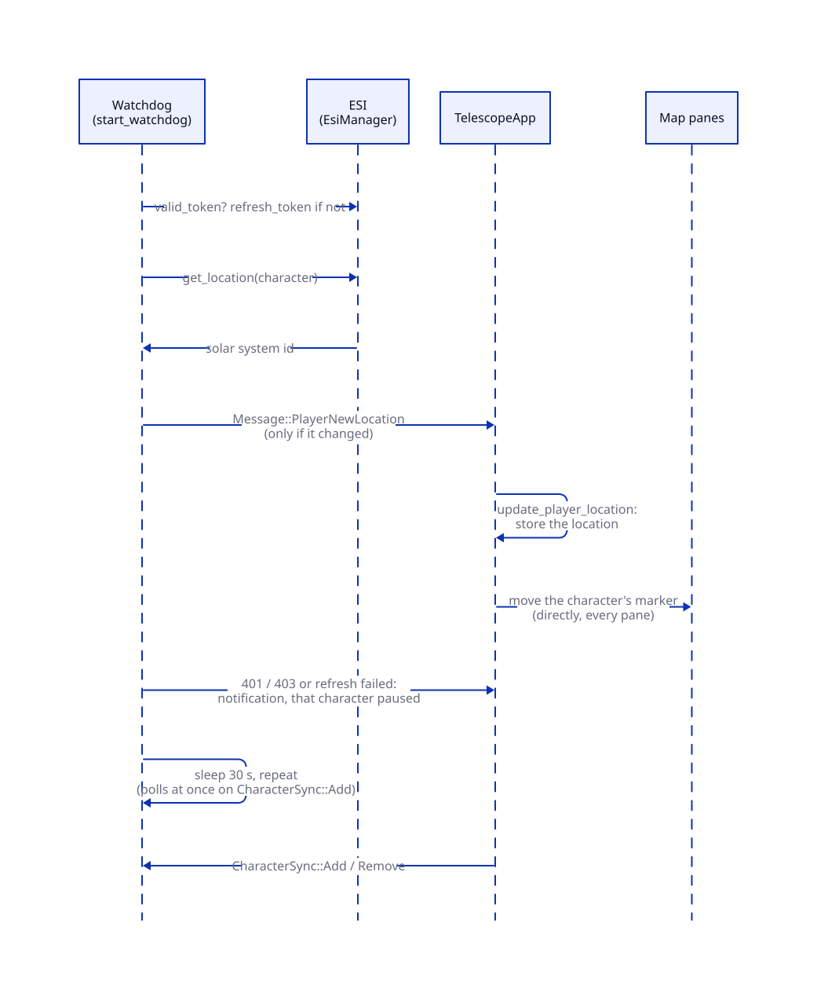

# Architecture

Telescope is a desktop application (egui/eframe with the wgpu renderer) that
watches the chat logs of EVE Online, evaluates their text against configurable
pattern rules and shows the resulting alerts on interactive maps of New Eden.
Characters linked through EVE SSO are followed through ESI so the maps can show
where they are and warn about nearby threats.

This document is a map of the code: where things live and how they talk to
each other. For how to build and run it see [BUILD.md](BUILD.md).

## Workspace

| Crate | Path | Role |
|-------|------|------|
| `telescope` | `crates/telescope` | The application: a binary plus a small library (`TelescopeApp`). UI, settings, file watching and alerting. |
| `webb` | `crates/webb` | EVE back end with no UI: the local OAuth callback server, the ESI client, the local player database, the intel rules (`graph`, `rules`, `intel`) and the map-tooltip `map_alerts`. |
| `native_tools` | `crates/native_tools` | OS-specific code: native file / folder dialogs and per-machine identification. |
| `egui-panels` | `crates/egui-panels` | Building blocks for settings screens in egui (pages, sections, forms, switches, sliders, tiles, side navigation, action bar, `Draft`), with no dependency on the rest of the workspace so other projects can use it. |



Two more crates by the same author, published on crates.io, are used from outside this workspace:

* `sde`: parses CCP's Static Data Export, builds the SDE database and answers
  universe queries (`SdeManager`, `Universe`).
* `egui-map`: the egui widget that draws the maps.

Both are resolved from crates.io. The workspace `Cargo.toml` keeps
commented-out `[patch.crates-io]` entries that point at sibling checkouts
(`../sde` and `../egui-map`): uncomment them to develop those crates together
with Telescope.

### `crates/webb`

| Module | Purpose |
|--------|---------|
| `auth_service` | Tiny `hyper` server that receives the SSO redirect (`/login?code=...&state=...`) and hands both values to the application. |
| `esi` | `EsiManagerCore`: authorization, token refresh, location and portrait queries, and reading / writing characters, corporations and alliances. |
| `esi/player_database` | SQLite schema and queries of the player database (encrypted with SQLCipher under the default `crypted-db` feature). |
| `esi/data` | ESI client configuration. |
| `objects` | Domain types: tokens and the `Character`, `Corporation` and `Alliance` entities. |
| `graph` | The intel node graph: typed `Node`s (Input/Detection/Output/Aggregator/Gate/Formatter) and `Edge`s, `RuleGraph` validation, the per-line `Executor` (which propagates a true / false / absent signal per pin: a Detection's T is true when it matched, F when it did not; absent means "not evaluated", and a `not` of it stays absent), the embedded default graph (`default_graph`, from `rules.toml`) and the `SystemResolver`. This is the model persisted in the player database and edited by *Settings -> Rules*. |
| `rules` | The typed building blocks the graph shares: `DetectionRuleKind`/`DetectionType`, `OutputKind`/`OutputType`, `InputKind`, the built-in `Dictionaries`, `IntelLine` and `parse_line`. |
| `intel` | What the intel modules share: `IntelLine`, `IntelCategory`, `PatternError` (rule validation errors), the size limits and text helpers. The old `patterns.toml` engine (and the file) were removed; the graph replaced them. |
| `map_alerts` | `AlertSummary::from_messages` condenses a line's `Mensaje`s into what a map node's tooltip shows; `AlertLog` keeps each system's active alerts, deduplicated and expiring on their own. |

### `crates/native_tools`

| Module | Purpose |
|--------|---------|
| `dialog` | Open file / folder dialogs: `IFileOpenDialog` on Windows, `NSOpenPanel` on macOS, the XDG desktop portal on Linux. |
| `zbus` (Linux only) | Machine identification through DMI, D-Bus and machine-id fallbacks. |
| `lib.rs` | Per-OS `get_*_unique_id` functions. |

## The `telescope` crate

```text
crates/telescope/src
├── main.rs                  entry point: logging / tracing setup, opens the window
├── lib.rs                   exports TelescopeApp and patterns; loads the translations
├── i18n.rs                  interface language: available languages, "auto", switching
├── repaint.rs               wakes the UI from other threads (request_repaint)
├── app.rs                   TelescopeApp: state, construction, per-frame ui(),
│                            event_manager() and map pane management
└── app/
    ├── data.rs              static ESI application data (scopes, callback URL, keys)
    ├── database.rs          storing linked characters, SDE build cache, reload after an SDE update
    ├── database_updater.rs  progress window + background SDE check / build
    ├── file.rs              notify event handler for the chat log directory
    ├── intel/               the intel pipeline (see "Chat log -> alert")
    │   ├── mod.rs           TelescopeApp methods: apply_intel_settings(), load_intel_file(),
    │   │                    process_detected_line(), the visual/sound/log resolvers
    │   ├── input.rs         IntelLogName, UTF-16LE decoding, ChatLogSource -> InputEvent,
    │   │                    IntelOffsets (where each monitored log was last read)
    │   ├── detection.rs     the detection thread (graph Executor behind an RwLock)
    │   └── resolve.rs       UniverseResolver / SharedResolver (system ids) and jump distance
    ├── messages.rs          Message, MapSync, CharacterSync, spawners and send helpers
    ├── notifications.rs     the on-screen status log
    ├── persistence.rs       save_settings()
    ├── settings.rs          Settings: paths, map options, channels; persisted to a TOML file
    ├── tiles.rs             egui_tiles panes: UniversePane, RegionPane, TreeBehavior
    ├── watchdog.rs          background location polling of the linked characters
    ├── windows.rs
    └── windows/
        ├── about.rs         About window
        ├── debug.rs         debug window
        ├── settings.rs      Settings screen (egui-panels): navigation, pages, Cancel / Apply / Accept,
        │                    which pages have changes not applied
        └── settings/
            ├── sources.rs        chat log folder and watched channels, with their activity
            ├── patterns.rs       Rules: input cards + node editor, live graph validity
            ├── alerts.rs         alert distance, map alert, sound, "Test the full alert"
            ├── maps.rs           start-up regions, character glow intensity
            ├── characters.rs     linked characters
            └── application.rs    interface language, SDE and private database paths
```

The interface texts live in `crates/telescope/locales/<code>.toml` (see
[Languages](#languages)).



`TelescopeApp` is one struct; the modules above only add `impl TelescopeApp`
blocks (or free helpers), so the state stays in a single place and every
submodule can reach it.

## Runtime files

Telescope reads and writes these in the directory it runs from:

| File | Content |
|------|---------|
| `telescope.toml` | User settings (`Settings`). |
| `rules.toml` | Optional export/import of the whole rule configuration (*Settings -> Rules*). |
| `sde.db` | The SDE database. Built automatically when it does not exist. |
| player database | Linked characters and one OAuth token set per character (`telescope.db` by default; the path is set in *Settings -> Application*), plus the intel rules (the `node`/`edge` graph tables). Its schema version is stored in `metadata`: on startup a database from an older version only gets the pending migration scripts (`MIGRATIONS` in `player_database.rs`), keeping its data, and the user is notified. A new database is created with the base schema (version 0) followed by every migration, so both paths end in the same schema. |

## Languages

Every text the user reads comes from `t!("section.key")` (`rust-i18n`), looked
up in `crates/telescope/locales/<code>.toml`: one file per language, all with
the same keys, embedded in the binary at compile time. A key missing from a
language falls back to English, but an empty value is shown blank. The `i18n`
tests check that every file has exactly the keys of `en.toml`, and the same
`%{placeholders}` in every value that isn't empty.

- **Adding a language** is adding its file (copy `en.toml`, translate the
  values, including `language.name`). *Settings -> Application* lists it on its own
  once `language.name` has a value. `es.toml` is such a template today: every
  key, empty values, not offered yet.
- **The chosen language** is `language` in `telescope.toml`'s `[ui]` table:
  `"auto"` (the operating system's language, English when there is no file for
  it) or a file name such as `"es"`. It is applied at start-up and as soon as
  it changes in *Settings -> Application* (a preview: *Cancel* goes back to
  the previous language), and saved with the other settings on *Apply*.
- **Not translated:** `tracing` output, the log panel messages and the Debug
  window, so bug reports read the same in every language.
- **Fonts:** Noto Sans CJK (`assets/NotoSansCJK-Medium.ttc`, Simplified
  Chinese face) is always the fallback after egui's own fonts, whatever the
  interface language: intel channels carry Chinese, Japanese, Korean and
  Russian lines. `TelescopeApp::font_definitions` sets it up and a test checks
  those scripts are drawn.

## Threads and messages

The UI runs on the main thread: every frame `TelescopeApp::ui` first drains
`event_manager()` and then draws. Anything slow or blocking runs elsewhere, on
its own thread with a small Tokio runtime, and reports back with messages:



| Channel | Type | Direction |
|---------|------|-----------|
| `Message` | `mpsc` | anything -> the app (`event_manager` dispatches it) |
| `MapSync` | `broadcast` | the app -> every map pane (center on, system alert, player moved) |
| `CharacterSync` | `mpsc` | the app -> the watchdog (add / remove a linked character) |

From the UI thread use `MessageSpawner::spawn`; from async code use
`send_app_message`. `Message::kind()` gives a short name for tracing without
logging the payload.

Background threads: the `notify` watcher callbacks (`file.rs`), the OAuth
callback server (`AuthSpawner`), the watchdog and the `DatabaseUpdater`.

## Main flows

### Chat log -> alert



1. `IntelEventHandler` (`file.rs`) receives filesystem events for the intel
   directory. Writes to the log of a monitored channel become
   `Message::IntelFileChanged`; files appearing or disappearing become
   `Message::ScanIntelFiles`. Channels are recognised with
   `IntelLogName::parse`, the only place that knows the log file name format.
2. `event_manager` calls `load_intel_file`, which reads only the complete
   lines added since the last read (`IntelOffsets`: a monitored log starts at
   its end when first seen, so history is never replayed; a rescan never moves
   a known offset), decodes them from UTF-16LE (`intel/input.rs`) and emits
   one `InputEvent` per parsed line to the detection thread. Every sender of
   work for the UI (app messages, the detection thread, the log bridge) wakes
   it with `repaint::request`, so nothing waits for the next mouse move.
3. The detection thread (`intel/detection.rs`) runs the graph `Executor` over the
   line and sends its `Activation`s back to the UI.
4. `process_detected_line` (`intel/mod.rs`) dispatches the Output nodes that
   fired: *visual* pulses the map node (`MapSync::SystemAlert`; the systems were
   resolved by the Detection node through the injected `SystemResolver`,
   `intel/resolve.rs`), *sound* plays the alarm and centers the maps, *log*
   sends a `GenericNotification` shown in the status log (`notifications.rs`),
   *tooltip* lists the line in the node tooltips (`MapSync::SystemTooltip`), and
   *suppress* vetoes the visual and sound alerts.

### Linking a character



1. *Settings -> Characters -> Link character* asks `EsiManager` for the authorize URL,
   hands `AuthSpawner` an `AuthRequest` (a clone of the `EsiManager` plus that
   authorize info) and opens the URL in the browser.
2. The `AuthSpawner` thread runs `webb::auth_service` on
   `http://localhost:56123/login`. When the redirect's `code` and `state`
   arrive, that same background thread completes the authorization with its
   `EsiManager` clone (`EsiManager::auth_user`: the `state` must be the one
   sent in the login URL, then token exchange, character,
   corporation and alliance lookups, and storing the character), so the UI
   thread never waits on the network.
3. The result comes back as `Message::CharacterAuthenticated`.
   `handle_character_authenticated` (`character_link.rs`) takes that
   character's tokens from the clone (`EsiManager::adopt_session`), keeps the
   character (a re-linked character replaces its old entry), and starts the
   watchdog if it is the first one; otherwise it sends `CharacterSync::Add`
   (the watchdog then reloads the stored tokens).

### Location tracking



`start_watchdog` polls ESI every 25 seconds. Each character is asked for its
location with its own token (an EVE SSO token only works for the character
that logged in), refreshed when needed. A change produces
`Message::PlayerNewLocation` (the app stores the new location) and
`MapSync::PlayerMoved` (the map panes move the marker). If a character's token
is rejected (401/403) or can't be renewed, only that character stops being
followed, with a notification to link it again; linking it again resumes it.
The task ends when no characters are left.

### SDE database

`DatabaseUpdater` runs on its own thread: it checks CCP's SDE index, downloads
and extracts it when needed, creates the schema and builds the database
into `sde.db.building`, which replaces `sde.db` only once complete (a failed
update keeps the previous database), reporting through `Message::DatabaseUpdateProgress` and
`Message::DatabaseUpdated`. It starts automatically when the database does not
exist and on demand from *Settings -> Application* (its progress window shows
over the Settings screen too).

### Saving settings

The Settings screen is full-window, built with `egui-panels`. Its pages follow
an intel line (*Sources -> Rules -> Alerts*, with a stepper at the top of
those three), then *Maps*, *Characters* and *Application*.

Every change is a draft. Opening the screen rescans the chat log folder and
snapshots `Settings` (the rules editor keeps its own working graph); a page
whose values differ from the snapshot (or, for *Rules*, whose graph differs
from the running one) shows a dot in the navigation, and the bar lists them.
*Apply* merges the rule open in the node editor, validates the rules, calls
`save_settings` (`persistence.rs`: records the start-up regions, calls
`apply_intel_settings` to update the channel list the watcher reads and
re-register the directory watch, and writes the settings file), redraws the
maps with the new node style (the character glow) and applies the rules
(persists them to `telescope.db` and reloads the executor), then takes a new
snapshot; *Accept* does the same and closes. *Cancel* restores the snapshot,
the previewed language and the start-up region checks, and re-applies them.
Linking and unlinking characters are not drafts: they go through EVE SSO and
apply at once.

## Extending Telescope

* **A settings page:** add a variant to `SettingsPage` with its `title()` and
  `icon()` (`messages.rs`), write `show_<name>_page` in a new file under
  `windows/settings/` with the `egui-panels` components (`page`,
  `page_header`, `Section`, `form`...), put it in a navigation group and the
  `match` in `windows/settings.rs`, and compare its values in
  `dirty_settings_pages`.
* **A rule:** edit it in *Settings -> Rules*: the rule cards (description
  and id editable in the card, an enable switch, what the rule is made of and
  the outputs it reaches) open the graph editor, whose toolbar creates detections, outputs and logic nodes
  (aggregator / gates / formatter). Import/export `rules.toml`; the model is
  `RuleGraph` in `crates/webb/src/graph.rs`, the tables (`node`/`edge`) are
  created by the player database's `migrate_1_to_2`, and the built-in default
  graph is the embedded `rules.toml` (`RuleGraph::default_graph`).
* **A message:** add a variant to `Message` and to `Message::kind()`
  (`messages.rs`), and handle it in `event_manager` (`app.rs`).
