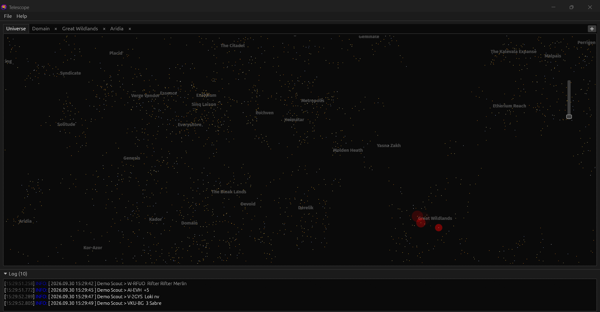
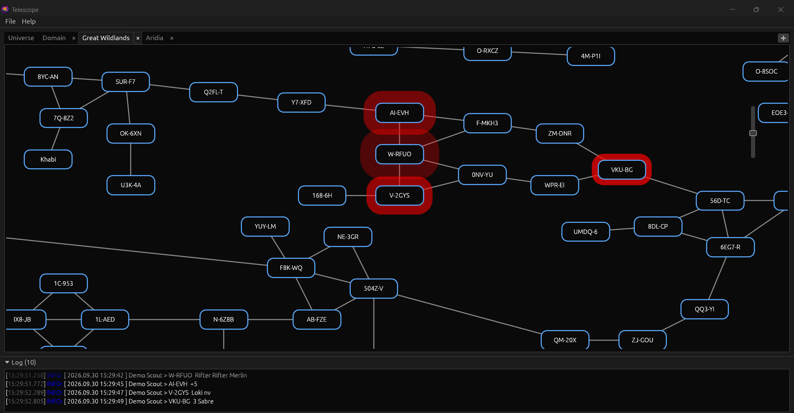
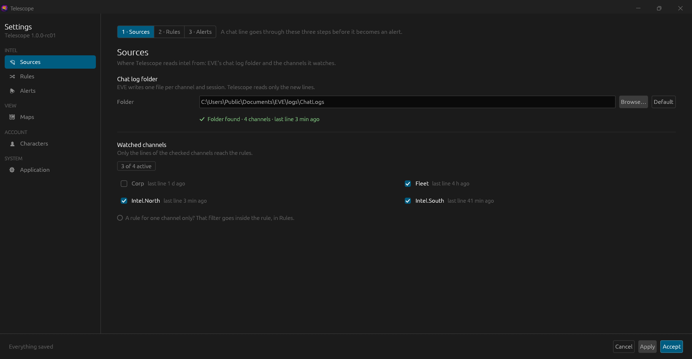
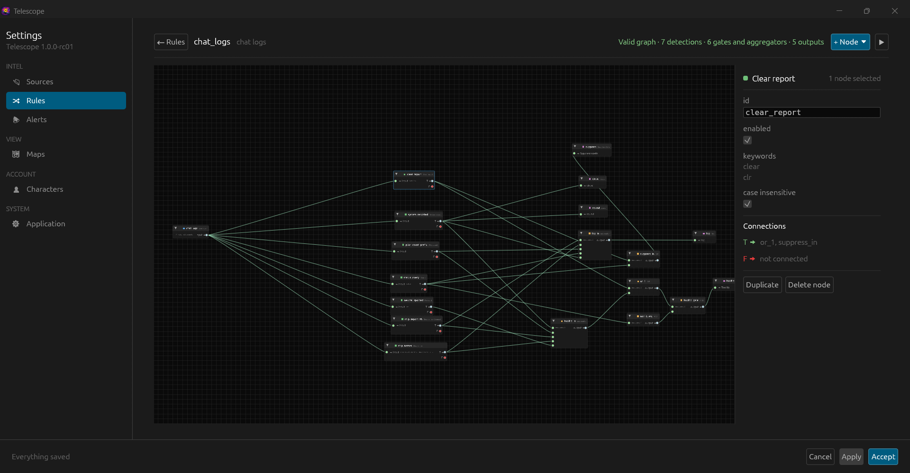
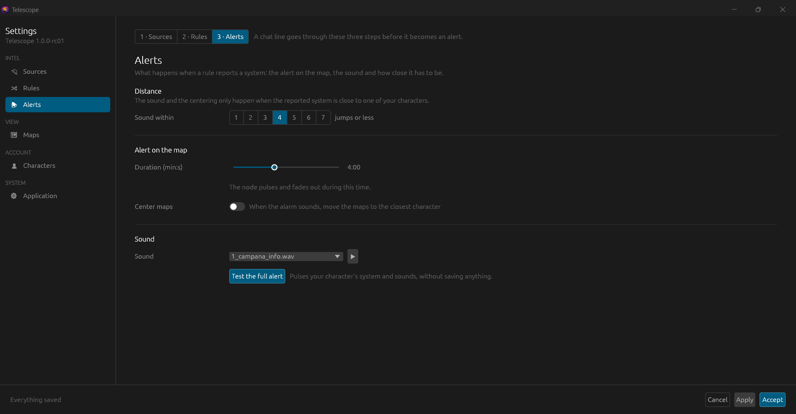
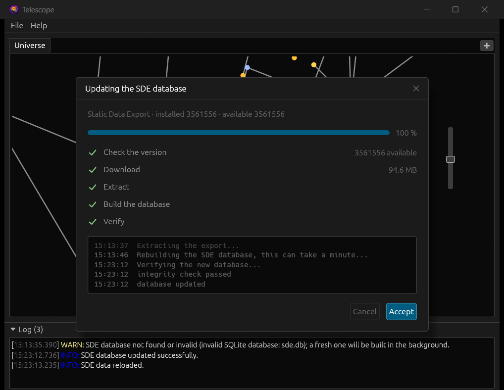
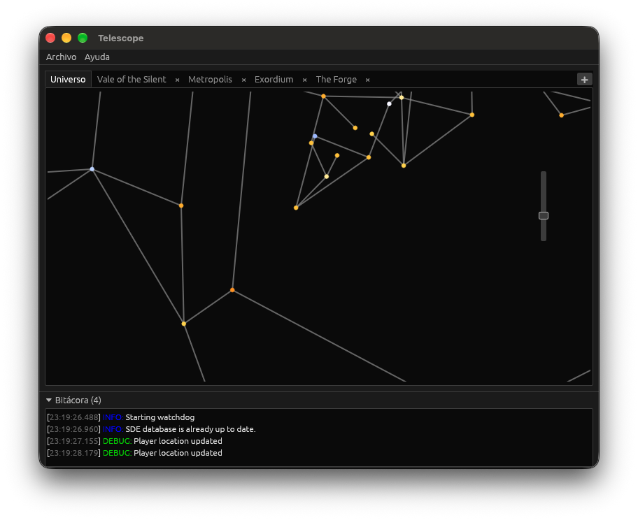

# Telescope

[](https://github.com/rafaga/telescope/actions/workflows/ci.yml)
[](https://github.com/rafaga/telescope/actions/workflows/security.yml)
[](https://discord.gg/v9SseaWhz4)

Telescope is a desktop application that watches your EVE Online chat logs,
evaluates them against configurable pattern rules and shows the resulting
alerts on interactive maps of New Eden. Characters linked through EVE SSO are
followed through ESI so the maps can show where they are and warn about
nearby threats. It is similar to other intel gathering tools, but with some
key differences.

* Designed to be multiplatform (Windows, macOS and Linux).
* Designed to be as easy to use as possible.
* Designed with privacy in mind. Your data resides in your computer.

## Features

* **Intel watching** — monitors the EVE chat log directory and parses new
  lines as they are written, recognising the channel from the log file name.
* **Intel rules** — a node graph edited in *Settings -> Rules*: inputs
  (chat logs), detections (systems, ships, pilot counts, keywords, custom
  regexes or word lists), logic nodes (aggregators, gates, formatters) and
  outputs (map alert, sound, log, tooltip, suppress). Stored in the local
  database; the whole graph can be exported to or imported from
  `rules.toml`.
* **Interactive maps** — universe and per-region maps with system alerts
  raised directly from intel matches.
* **Alerts you can hear** — a rule's *sound* output plays an alarm clip you
  choose, and map nodes list the ships and pilot counts of each report in
  their tooltip. The work runs on its own threads, so an alarm is not delayed
  by a hidden or stalled window.
* **Character linking via EVE SSO** — authorizes through ESI and keeps
  linked characters, their corporations and alliances in a local database.
  The database, tokens included, is encrypted with SQLCipher and keyed from
  your machine's identifier.
* **Location tracking** — a background watchdog polls ESI for each linked
  character's location and moves their marker on the maps.
* **Automatic SDE updates** — the CCP Static Data Export database is checked,
  downloaded and built automatically the first time Telescope runs, and it
  keeps itself up to date. A progress window shows what it is doing.
* **Settings with a draft** — every change stays a draft until *Apply* /
  *Accept*; *Cancel* puts everything back, the interface language included.
* **Languages** — the interface is available in English and Spanish, and
  follows your operating system's language by default.

Platforms tested by hand:

* MacOS Tahoe (ARM64)
* Windows 11 (ARM64)
* Windows 11 (Intel x86-64)

CI builds and tests every change on Linux, Windows and macOS.

## Screenshots

| | |
|---|---|
|  |  |
| **Universe map.** Every region you choose opens as a tab; alerts show here too. | **Region map.** The nodes an intel line reports pulse, and the line lands in the status log. |
|  |  |
| **Sources.** The chat log folder, its channels and when each last spoke. | **Rules.** The graph of detections, logic and outputs, with the selected node's fields. |
|  |  |
| **Alerts.** How close, for how long and with which sound. | **SDE database.** Built automatically the first time Telescope runs. |

Telescope running on macOS (Apple Silicon):



## Community

Questions, ideas, bug reports and rule sets to share are welcome on the
[Discord server](https://discord.gg/v9SseaWhz4). Bugs and feature requests are
also tracked as [GitHub issues](https://github.com/rafaga/telescope/issues).

## Building and running

```sh
cargo run --release
```

You do not need to provide the SDE database yourself, Telescope builds it on
first run. You do need your own ESI application (client id and secret key)
from CCP, given to the build as the `ESI_CLIENT_ID` and `ESI_SECRET_KEY`
environment variables — see [BUILD.md](BUILD.md) for the full requirements,
ESI credential setup, tests, logging and profiling instructions.

## Documentation

* [ARCHITECTURE.md](ARCHITECTURE.md) — a map of the code: the workspace's
  crates, the `telescope` crate's modules, threads and messages, and the main
  flows (chat log to alert, linking a character, location tracking, SDE
  updates), illustrated with diagrams.
* [BUILD.md](BUILD.md) — requirements, ESI credentials, building, tests and
  coverage, the CI workflows (`check.sh` runs them locally), logging and Tracy
  profiling.
* [CHANGELOG.md](CHANGELOG.md) — notable changes, following
  [Keep a Changelog](https://keepachangelog.com/en/1.1.0/).
* The crates of the workspace: [`webb`](crates/webb/README.md) (intel rule
  engine and EVE back end), [`egui-panels`](crates/egui-panels/README.md)
  (settings screen components) and
  [`native_tools`](crates/native_tools/README.md) (native dialogs and machine
  identification).

## License

MIT, see [LICENSE.md](LICENSE.md).
